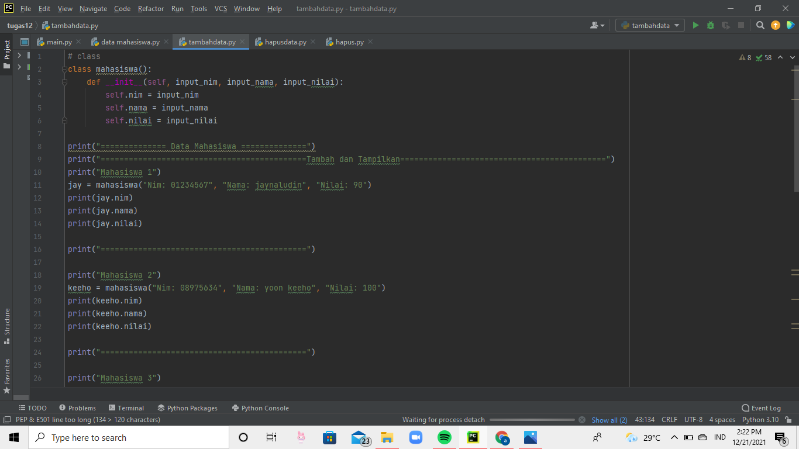
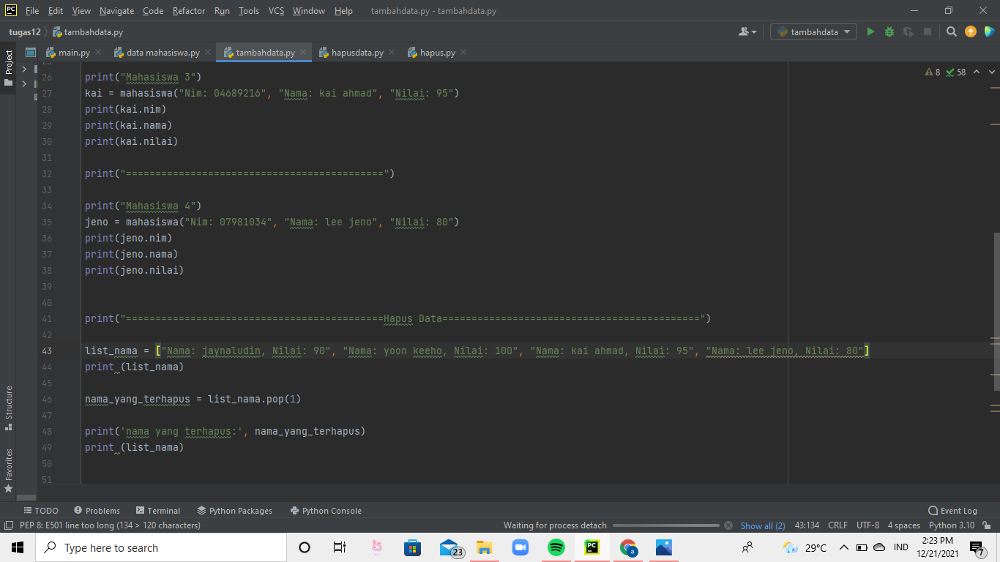
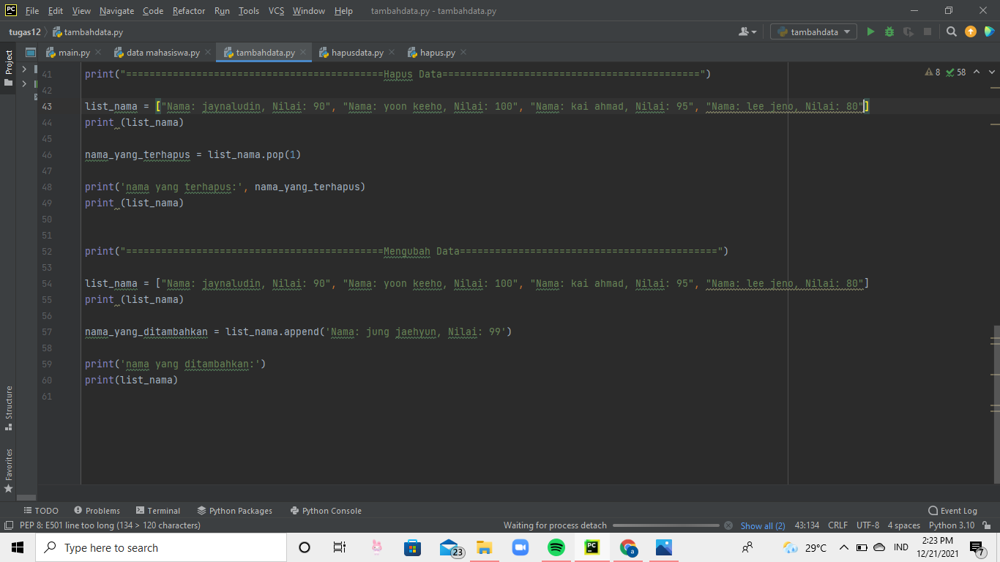
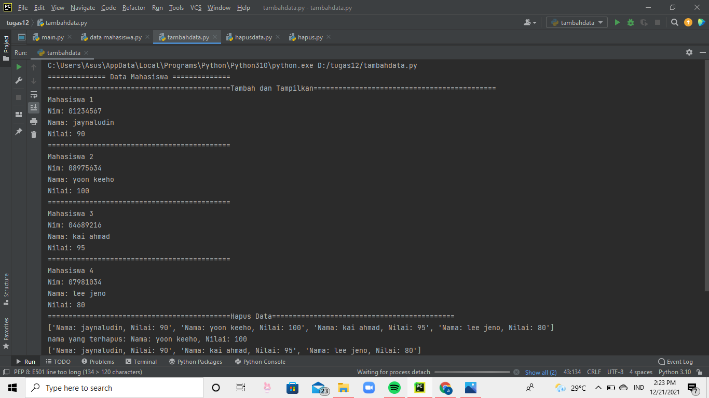
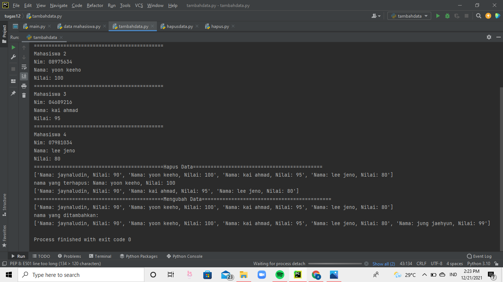

# tugas12

## Menampilkam Data Mahasiswa Menggunakan Method 
metode/method atau fungsi ini merupakan sebuah kumpulan code program yang digunakan untuk melakukan suatu perintah. Dan bedanya dengan baris code program biasa adalah, kita dapat melakukan hal yang sama cukup dengan  memanggil nama metode nya saja, Tanpa harus menuliskan code program yang ingin kita ulang. 

### Tambah Data dan Tampilkan Data
kode program tambah data method adalah 
def __init__(self, nama) 

code programnya seperti dibawah ini 

### Menghapus Data
untuk code program hapus, menggunakan .pop() 

lalu di print 

### Mengubah Data 
lalu untuk code program mengubah data, menggunakan .append() 

lalu diprint 

### Hasil Outputnya Akan Menjadi Seperti Di Bawah ini: 

